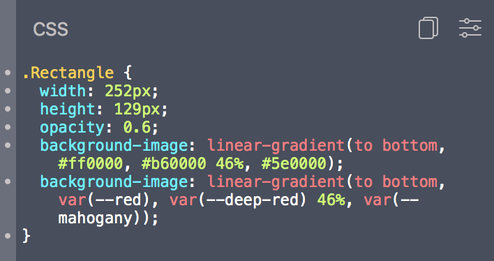

<p align="center">
    
</p>

# Zeplin Extension Documentation ⚗️📚

Zeplin extensions are JavaScript modules that generate code snippets from various design elements. All code snippets you interact with in Zeplin are generated using extensions and they're curated at [extensions.zeplin.io](https://extensions.zeplin.io).

If you're interested in developing your own Zeplin extension, this documentation covers the basics of building one along with a [tutorial](tutorial.md) and discusses their capabilities. Ping us at [extensions@zeplin.io](mailto:extensions@zeplin.io) if you have any questions—we'd love to hear what you're building!

If you just want to try out extensions and ended up here by mistake, head to [extensions.zeplin.io](https://extensions.zeplin.io) to browse them.

## What is an extension?



Extensions are JavaScript modules that implement various functions to generate code snippets from models.

In the example above, Zeplin invokes the `layer` function of the extension, passing the selected layer object as a parameter. Returned value is then displayed. Code highlighting is performed by Zeplin, extensions only communicate the preferred language.

## Getting started

[zem](https://github.com/zeplin/zem), Zeplin extension manager, is a command line tool that lets you quickly create, test and publish extensions.

If you have npm 5.2+ installed, you can run zem directly to create one:

```sh
npx zem create my-extension
```

Under `my-extension`, zem will generate the initial project structure:

```
my-extension
├── README.md
├── package.json
└── src
    └── index.js
```

#### `index.js`

Default entry point for the extension, a JavaScript document that exports functions, corresponding to different actions. To name a few:

- `colors`: Generates snippets from Project or Styleguide colors.
- `layer`: Generates snippets from the selected layer.
- `screen`: Generates snippets from the screen.
- `component`: Generates snippets the selected component.

[See `Extension` documentation](model/extension.md) for all the functions and their details.

#### `package.json`

npm's `package.json` defines everything you, and Zeplin, need to know about an extension, along with its dependencies.

Apart from basic information like name and description, under the `zeplin` key, extensions can also define options.

[See `package.json` documentation](package.md) for details.

### Running an extension

zem lets you run an extension in the command line, during development. You can execute functions with sample data and observe the results, without running the extension inside Zeplin.

To learn more about zem and the `exec` command, [see documentation](https://github.com/zeplin/zem).

## Your first extension

We've prepared a tutorial to guide you through your first Zeplin extension, dive in:

<h3 align="center">
    🎓 <a href="tutorial.md">View tutorial</a>
</h3>

## Models

Quickly jump to the documentation of a particular model to learn more about it.

- [`Extension`](model/extension.md)
- [`Context`](model/context.md)
- [`Project`](model/project.md)
- [`Styleguide`](model/styleguide.md)
- [`Screen`](model/screen.md)
- [`Component`](model/component.md)
- [`Version`](model/version.md)
- [`Color`](model/color.md)
- [`Gradient`](model/gradient.md)
- [`ColorStop`](model/colorStop.md)
- [`TextStyle`](model/textStyle.md)
- [`Layer`](model/layer.md)
- [`Fill`](model/fill.md)
- [`Border`](model/border.md)
- [`Shadow`](model/shadow.md)
- [`Blur`](model/blur.md)

## Publishing an extension

When you're ready, zem lets you publish an extension to [extensions.zeplin.io](https://extensions.zeplin.io). Publishing an extension will submit it for review and you'll be notified via email once the extension is listed.

To learn more about zem and the `publish` command, [see documentation](https://github.com/zeplin/zem).

## Examples

### Stylesheet

[zeplin/stylesheet-extensions](https://github.com/zeplin/stylesheet-extensions)

Official stylesheet extensions used in Zeplin are open source, collected under a monorepo, **generating CSS, Less, SCSS, Sass, Stylus snippets** from colors, text styles and layers.

All stylesheet extensions make use of a package called [`zeplin-extension-style-kit`](https://github.com/zeplin/stylesheet-extensions/blob/master/packages/zeplin-extension-style-kit) that extracts CSS-like style properties from design elements. If you're building an extension that generates CSS-like snippets, like a preprocessor or a CSS-in-JS solution, [`zeplin-extension-style-kit`](https://github.com/zeplin/stylesheet-extensions/blob/master/packages/zeplin-extension-style-kit) should get you halfway there.

### React Native

[zeplin/react-native-extension](https://github.com/zeplin/react-native-extension)

Official React Native extension used in Zeplin is open source. It's a full-fledged extension example, generating React Native JavaScript snippets from colors, text styles and layers.

Although it's an ideal candidate, currently React Native extension isn't built upon [`zeplin-extension-style-kit`](https://github.com/zeplin/stylesheet-extensions/blob/master/packages/zeplin-extension-style-kit)—we're on it!
