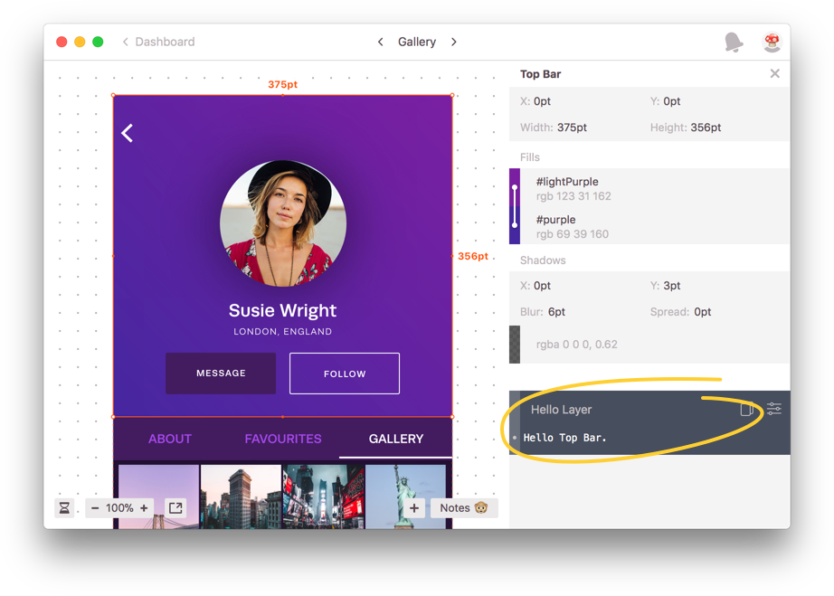

## Tutorial

☝️ _During the beta, you can only debug and work with local extensions using Zeplin's Mac app._

This short tutorial will guide you through your first Zeplin extension. Let's start with the two files you'll need.

### Manifest

This is the JSON document that defines everything Zeplin needs to know about the extension. Create a file called `manifest.json`:

```json
{
    "name": "Hello Layer",
    "description": "Greets layers.",
    "version": "0.1.0",
    "moduleURL": "index.js"
}
```

Name, description and version fields are pretty self explanatory. Maybe the most important field here, the module URL, defines where our JavaScript module is.

### JavaScript Module

As we defined our module URL as a relative path, go ahead and create a file called `index.js` right next to the manifest file. This is where our JavaScript code will live.

Start with a simple function:

```javascript
function layer(context, layer) {
    return "Hello " + layer.name + "."
};
```

`layer` function is one of the pre-defined functions that Zeplin expects from extensions. Every time a layer is selected, Zeplin should call this function and display the result.

Let's try it out.

### Adding a local extension

During the beta, to debug and work with your extensions, you can add them to your Zeplin projects locally from their Extensions window.

Holding down the Option key will enable the “Add Local Extension” option on the title bar:


You could host these files (locally or on a server) and enter the manifest URL but the simplest way would to use the Browse button and pick the manifest file. This should add the extension to the project and that's pretty much it.

Go ahead, click a layer!



### Displaying code snippets

Instead of returning a string directly from our `layer` function, we can return an object to display a code snippet.

Let's update it to display a JSON instead:

```javascript
function layer(context, layer) {
    var object = {
        "layerName": layer.name,
        "projectName": context.project.name
    };

    var JSONString = JSON.stringify(object, null, 2);

    return {
        code: JSONString,
        language: "json"
    };
};
```

We now create an object first and turn it into a JSON string using `JSON.stringify`. Instead of returning the string directly though, we return an object to let Zeplin (no pun intended) know that we want this string to be highlighted as a JSON.

Here's how this should look like in Zeplin:


Displaying code snippets in the project Styleguide is pretty straightforward as well. Similar to the `layer` function, you can define `styleguideColors`, `styleguideTextStyles` and `comment` functions.

All the functions that an extension can define are listed in detail in the [`Extension`](model/extension.js) documentation.

### What's next?

So far, we've only accessed the name of the selected layer and the project but extensions can access pretty much all the data you see in Zeplin. In fact, all the built-in code snippets in Zeplin are implemented as extensions, using the same infrastructure.

Make sure to explore the documentation for the [manifest file](manifest.md), [extension functions](model/extension.md) and [models](model) to see what's in store! 📚

If you have any questions, feel free to ping us at [extensions@zeplin.io](mailto:extensions@zeplin.io).
