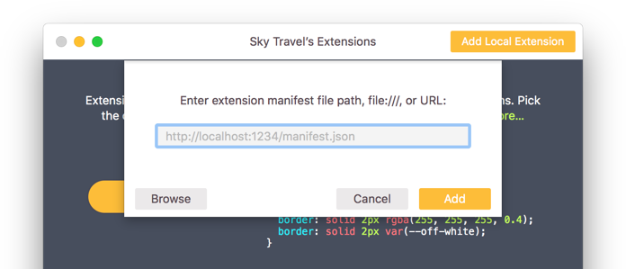
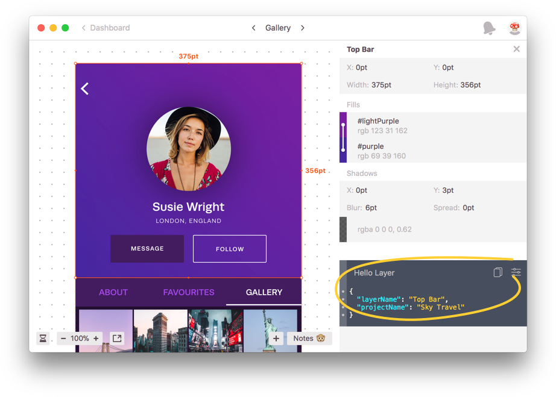

## Tutorial

This short tutorial will guide you through your first Zeplin extension.

### Installing zem

[zem](https://github.com/zeplin/zem), Zeplin extension manager, is a command line tool that lets you quickly create and test  extensions.

If you have npm 5.2+ installed (or node), you can run zem directly to create the extension:

Let's create it in a directory called `hello-layer`.

```sh
npx zem create hello-layer
```

If you have an older version of npm, you can install zem globally and run it right after:

```sh
npm install -g zem
zem create hello-layer
```

### Project structure

Under the `hello-layer` directory, zem should generate the initial project structure:

```
hello-layer
├── README.md
├── package.json
└── src
    └── index.js
```

#### `package.json`

Everything you, and Zeplin, need to know about an extension, along with its dependencies are defined in this JSON document. It functions as a regular npm `package.json` document, also containing Zeplin-specific properties.

Here's what zem generates by default:

```
{
    "name": "hello-layer",
    "description": "Sample description.",
    "version": "0.1.0",
    "scripts: {
        …
    },
    "devDependencies": {
        "zem": …
    },
    "zeplin": {
        "displayName": "hello-layer",
        "projectTypes": ["web"]
    }
}
```

Name, description and version properties are pretty self explanatory, they work just like they do in npm. Dependencies  include zem by default, letting you run scripts on the extension, which we'll get to in a bit. You can also add other npm packages as dependencies, as long as they work in the browser environment.

Notice that there's an additional property called `zeplin`, where Zeplin-specific properties live:

- `displayName` is the name of the extension displayed in the apps, not to be confused with the root `name` property, which is npm specific.
- `projectTypes` define which project types this extension should be available to.

Let's update `displayName` to “Hello Layer” and `projectType` to cover all the types, for the purpose of this tutorial:

```
    …
    "zeplin": {
        "displayName": "Hello Layer",
        "projectTypes": ["web", "ios", "android", "osx"]
    }
    …
```

Normally, a Swift extension for example, should only define `ios` and `osx` as the project types.

#### `index.js`

`index.js` is the default entry point for the extension, a JavaScript document, an ECMAScript module that exports functions corresponding to different actions in Zeplin.

By default zem adds all the functions that Zeplin supports to the module. For this tutorial, we're only interested in generating snippets from layers so we can delete all the other functions and their export statements. Every time a layer is selected, Zeplin should call this `layer` function and display the result.

Let's return a simple string from this function. `index.js` should look like this at this point:

```js
function layer(context, layer) {
    return `Hello ${layer.name}.`;
};

export default {
    layer
};
```

Time to give this extension a try.

### Testing

zem also lets you run an extension in the command line. You can execute functions with sample data and observe the results, without running the extension inside Zeplin.

Let's run the `exec` script for the `layer` function:

```sh
npm run exec -- layer
```

zem executes the function on a bunch of sample layers and outputs the results. The output for the first layer should look something like this:
```
Hello Layer with border.
```

### Displaying code snippets

Instead of returning a string directly from our `layer` function, we can return an object to display a code snippet.

Let's update it to display a JSON instead:

```js
function layer(context, layer) {
    const object = {
        "layerName": layer.name,
        "projectName": context.project.name
    };

    const JSONString = JSON.stringify(object, null, 2);

    return {
        code: JSONString,
        language: "json"
    };
};
```

We now create an object first and turn it into a JSON string using `JSON.stringify`. Instead of returning the string directly though, we return an object to let Zeplin (no pun intended) know that we want this string to be highlighted as a JSON.

Here's what we get, if we run the `exec` script again:

```json
{
  "layerName": "Top Bar",
  "projectName": "Sky Travel"
}
```

All looking good. Time to add this extension to Zeplin!

### Adding a local extension

During the beta, to debug and work with your extensions, you can add them to your Zeplin projects locally from their Extensions window.

On the Mac app, holding down the Option key will enable the “Add Local Extension” option on the title bar:



zem provides a script to serve the extension locally:

```sh
npm start
```

After running the script, enter `http://localhost:7070/manifest.json` as the URL and click Add.

That's pretty much it. Go ahead, click a layer!



### Displaying code snippets in the Styleguide

Displaying code snippets in the project Styleguide is pretty straightforward as well. Similar to the `layer` function, you can define `styleguideColors`, `styleguideTextStyles` and `comment` functions.

All the functions that an extension can define are listed in detail in the [`Extension`](model/extension.md) documentation.

### What's next?

So far, we've only accessed the name of the selected layer and the project but extensions can access pretty much all the data you see in Zeplin. In fact, all the built-in code snippets in Zeplin are implemented as extensions, using the same infrastructure.

Make sure to explore the documentation for [package.json](package.md), [extension functions](model/extension.md) and [models](model) to see what's in store! 📚

If you have any questions, feel free to ping us at [extensions@zeplin.io](mailto:extensions@zeplin.io).
